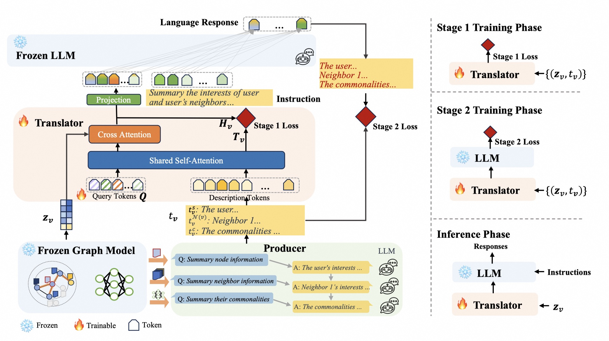

# GraphTranslator: Aligning Graph Model to Large Language Model for Open-ended Tasks

Code of our The Web Conference 2024 paper
[GraphTranslator: Aligning Graph Model to Large Language Model for Open-ended Tasks](https://arxiv.org/pdf/2402.07197.pdf)

Authors: [Mengmei Zhang](https://scholar.google.com/citations?hl=en&user=8Qokm1IAAAAJ), [Mingwei Sun](https://github.com/smw1996), [Peng Wang](https://github.com/PaulWongDlut), [Shen Fan](https://www.findshine.com), [Yanhu Mo](https://github.com/guyuisland), [Xiaoxiao Xu](https://openreview.net/profile?id=~Xiaoxiao_Xu1), [Hong Liu](https://openreview.net/profile?id=~Hong_Liu10), [Cheng Yang](https://scholar.google.com/citations?user=OlLjVUcAAAAJ&hl=zh-CN), [Chuan Shi](http://www.shichuan.org/)

## Model Pipeline



- **Pre-training Graph Model Phase.** In the pre-training phase, we employ link prediction as the self-supervised task for pre-training the graph model.

- **Producer Phase.** In the Producer phase, we employ LLM to summary Node/Neighbor Information.

- **Translator Training Phase.**

  ​	*Stage 1*: Training the Translator for GraphModel-Text alignment.

  ​	*Stage 2*: Training the Translator for GraphModel-LLM alignment.

- **Translator Generate Phase.** Generate the predictions with the pre-trained Translator model.

### Installation

We run our experiment with the following settings.

- CPU: Intel(R) Xeon(R) Platinum 8163 CPU @ 2.50GHz
- GPU: Tesla V100-SXM2-32GB
- OS: Linux (Ubuntu 18.04.6 LTS)
- Python==3.9, CUDA==11.4, Pytorch==1.12.1

The `./requirements.txt` list all Python libraries that GraphTranslator depend on, and you can install using:

```
conda create -n graphtranslator python=3.9
conda activate graphtranslator
git clone https://github.com/alibaba/GraphTranslator.git
cd GraphTranslator/
pip install -r requirements.txt
```

### Datasets & Models
  Download datasets and model checkpoints used in this project with huggingface api (recommend).

```
pip install -U huggingface_hub
```

**ArXiv Dataset**

Download files `bert_node_embeddings.pt`, `graphsage_node_embeddings.pt` and `titleabs.tsv` from [link](https://huggingface.co/datasets/Hualouz/GraphTranslator-arixv) and insert them to `./data/arxiv`.

```
huggingface-cli download --resume-download --local-dir-use-symlinks False --repo-type dataset Hualouz/GraphTranslator-arxiv --local-dir ./data/arxiv
```

**Translator Model**

Download `bert-base-uncased.zip` from [link](https://huggingface.co/Hualouz/Qformer/tree/main) and unzip it to `./Translator/models`.

```
huggingface-cli download --resume-download Hualouz/Qformer --local-dir ./Translator/models --local-dir-use-symlinks False
cd Translator/models/
unzip bert-base-uncased.zip
```

**ChatGLM2-6B Model**

Download the `ChatGLM2-6B` model from [link](https://huggingface.co/THUDM/chatglm2-6b) and insert it to `./Translator/models` 

```
huggingface-cli download --resume-download THUDM/chatglm2-6b --local-dir ./Translator/models/chatglm2-6b --local-dir-use-symlinks False
```

### Run

#### Producer Phase

- Generate node summary text with LLM (ChatGLM2-6B).

```
cd ./Producer/inference
python producer.py
```

#### Training Phase

Train the Translator model with the prepared ArXiv dataset.

- Stage 1 Training

Train the Translator for GraphModel-Text alignment. The training configurations are in the file `./Translator/train/pretrain_arxiv_stage1.yaml`.

```
cd ./Translator/train
python train.py --cfg-path ./pretrain_arxiv_stage1.yaml
```

After stage 1, you will get a model checkpoint stored in `./Translator/model_output/pretrain_arxiv_stage1/checkpoint_0.pth`.

- Stage 2 Training

Train the Translator for GraphModel-LLM alignment. The training configurations are in the file `./Translator/train/pretrain_arxiv_stage2.yaml`.

```
cd ./Translator/train
python train.py --cfg-path ./pretrain_arxiv_stage2.yaml
```

After stage 2, you will get a model checkpoint stored in `./Translator/model_output/pretrain_arxiv_stage2/checkpoint_0.pth`.

After all the training stages , you will get a model checkpoint that can translate GraphModel information into that the LLM can understand.

- **Note**: Training phase is not necessary if you only want to obtain inference results with our pre-trained model checkpoint. You can download our pre-trained checkpoint `checkpoint_0.pth` from [link](https://huggingface.co/Hualouz/Qformer/tree/main) and place it in the `./Translator/model_output/pretrain_arxiv_stage2` directory. Then skip the whole Training Phase and go to the Generate Phase.

#### Generate Phase

- generate prediction with the pre-trained Translator model. The generate configurations are in the file `./Translator/train/pretrain_arxiv_generate_stage2.yaml`. As to the inference efficiency, it may take a while to generate all the predictions and save them into file.

```
cd ./Translator/train
python generate.py
```

The generated prediction results will be saved in `./data/arxiv/pred.txt`.

#### Evaluation

Evaluate the accuracy of the generated predictions.

```
cd ./Evaluate
python eval.py
```

## Citation

```
@article{zhang2024graphtranslator,
  title={GraphTranslator: Aligning Graph Model to Large Language Model for Open-ended Tasks},
  author={Zhang, Mengmei and Sun, Mingwei and Wang, Peng and Fan, Shen and Mo, Yanhu and Xu, Xiaoxiao and Liu, Hong and Yang, Cheng and Shi, Chuan},
  journal={arXiv preprint arXiv:2402.07197},
  year={2024}
}
```

## Acknowledgements
Thanks to all the previous works that we used and that inspired us.

- [LAVIS](https://github.com/salesforce/LAVIS): The logical architecture of LAVIS library served as the foundation for our code development.
- [ChatGLM](https://github.com/THUDM/ChatGLM-6B): An open-source LLM with the amazing language capabilities.
- [BLIP2](https://arxiv.org/abs/2301.12597): our model is inspired from BLIP2.
